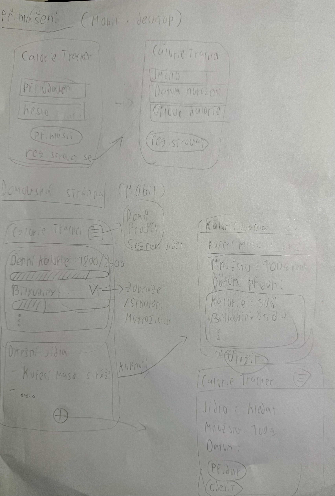
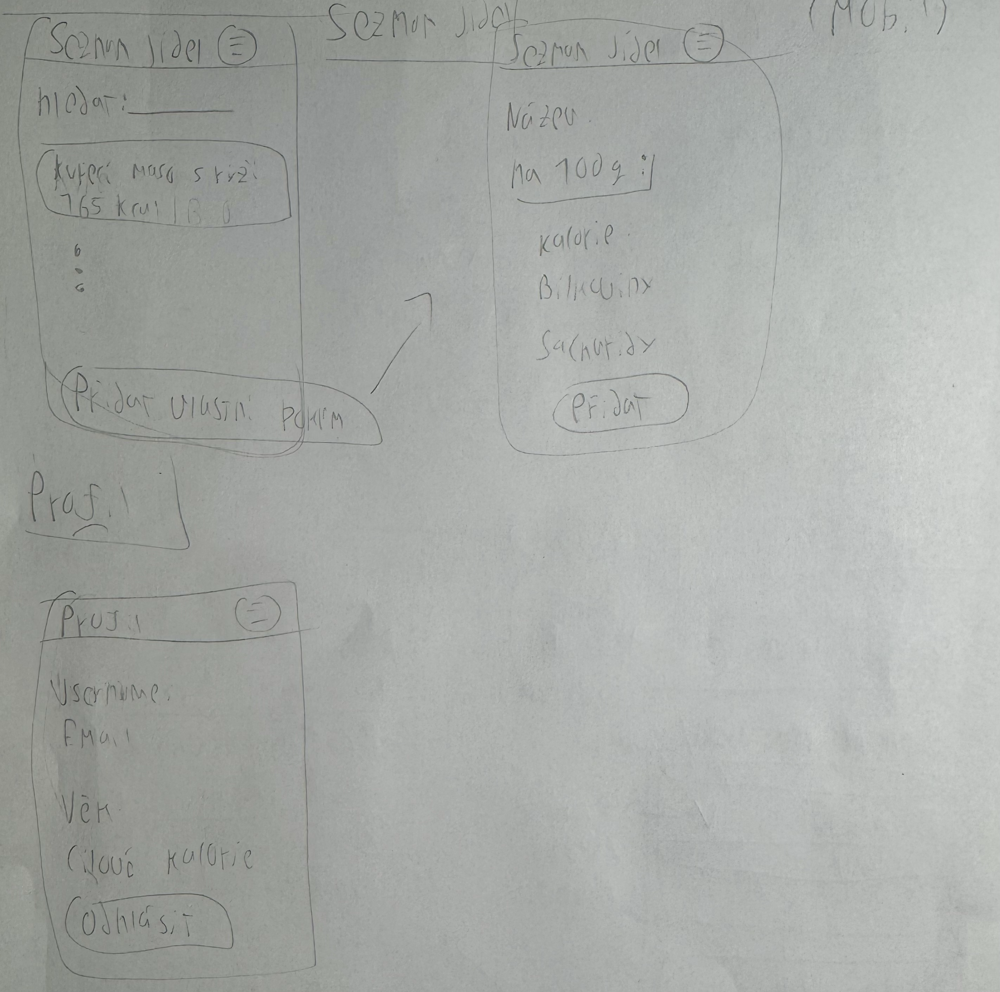
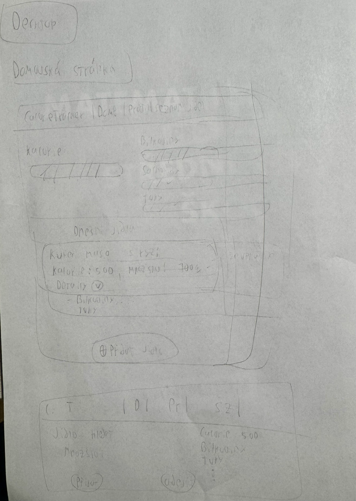
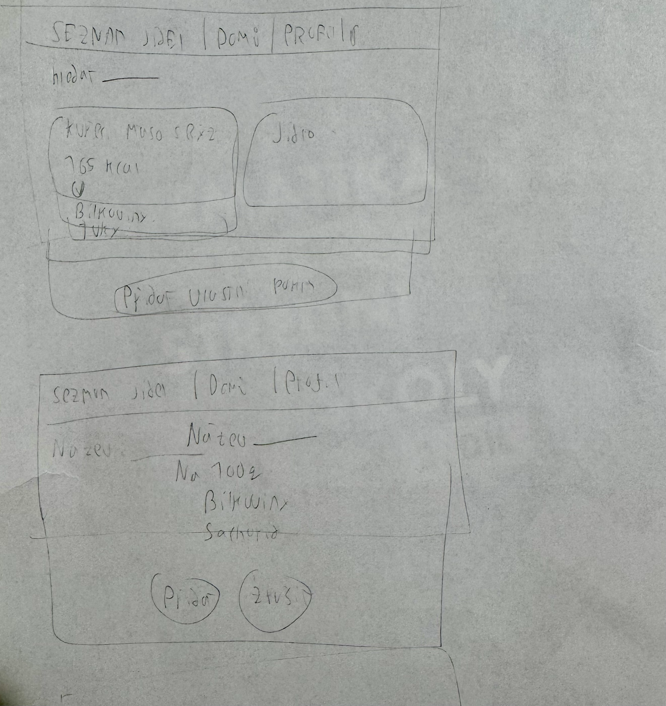
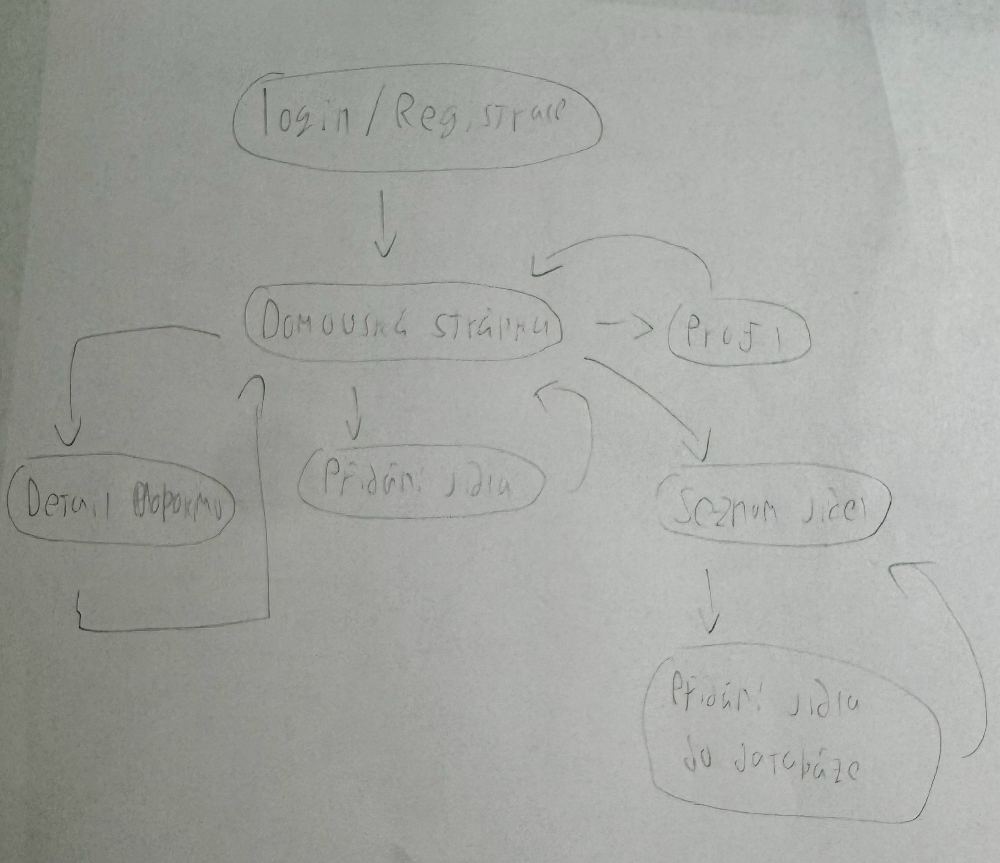
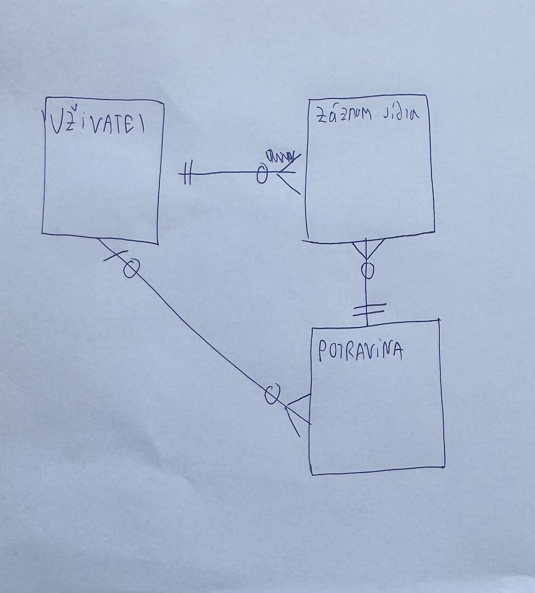

# CalorieTracker - Databáze jídel a sledování kalorií

Projekt CalorieTracker je webová aplikace zaměřená na sledování stravování a <u>nutričního příjmu</u> uživatele. Hlavním cílem aplikace je umožnit uživatelům zaznamenávat jejich pokrmy během dne a sledovat jejich denní příjem <u>kalorií</u> a <u>makroživin</u>.

V systému vystupují tři základní role: anonymní návštěvník, registrovaný uživatel a administrátor.

Anonymní návštěvník může zobrazovat základní informace o aplikaci bez schopnosti záznamu nebo sledování jídel a vytvořit si uživatelský účet. Po registraci získá uživatel přístup ke svému profilu a k hlavní stránce aplikace. Na této stránce se zobrazují informace o aktuálním denním příjmu <u>kalorií</u>, <u>makroživin</u>, seznam přidaných jídel a možnost přidat jílo z databáze.

Každé jídlo je v aplikaci uloženo jako samostatný záznam, který obsahuje název potraviny, množství, datum přidání, <u>kalorickou hodnotu</u> a jednotlivé <u>makroživiny</u>, tedy <u>bílkoviny, sacharidy a tuky, cukry, nasycené mastné kyseliny</u> a dále.

Uživate tak může pomocí vyhledávání rychle najít požadovanou potravinu a přidat ji do svého denního jídelníčku.

Součástí systému je také možnost, aby si uživatel přidal do své databáze pokrmů vlastní potravinu nebo jídlo, pokud se nenachází v existující databázi potravin. Při vytváření nového záznamu může uživatel zadat název, <u>kalorie</u> a jednotlivé <u>makroživiny</u>.

Role administrátora zajištue správu databáze potravin, například přidávání nových produktů do výchozí databáze, úpravu jejich <u>nutričních hodnot</u> nebo odstraňování chybných záznamů.

## Wireframes

### Mobil




### Desktop




## User flow



## E-R diagram



## Instalace a spuštění

### 1. Vytvoření venv

**Windows:**

```bash
py -3 -m venv venv
source venv/Scripts/activate
pip install -r requirements.txt
```

**MacOS / Linux**

```bash
python3 -m venv venv
source venv/bin/activate
pip install -r requirements.txt
```

### 2. Spuštění aplikace

**Windows:**

```bash
python ./prj/manage.py runserver
```

**MacOS / Linux:**

```bash
python3 ./prj/manage.py runserver
```
